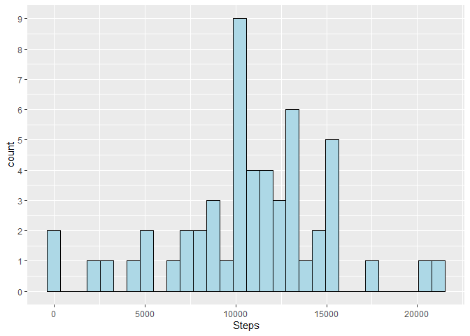
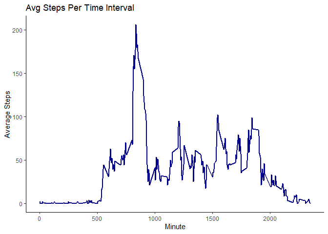
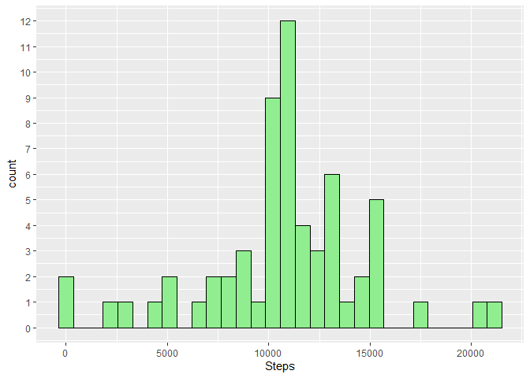
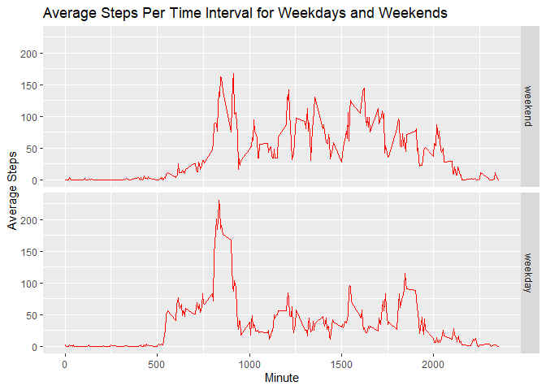

## Loading and preprocessing the data


```r
data <- read.csv("activity.csv", header = TRUE, na.strings = "NA")
data$date <- as.Date(data$date, "%Y-%m-%d")
```

## What is mean total number of steps taken per day?

First I'll use the R function ```xtabs()``` to create  a data frame with the total number of steps for each day. 


```r
library(stats)
dailySteps <- as.data.frame(xtabs(steps~date, data = data, addNA = TRUE))
colnames(dailySteps) <- c("Day", "Steps")
head(dailySteps)
```

```
##          Day Steps
## 1 2012-10-01    NA
## 2 2012-10-02   126
## 3 2012-10-03 11352
## 4 2012-10-04 12116
## 5 2012-10-05 13294
## 6 2012-10-06 15420
```

Plotting a histogram of Daily steps


```r
library(ggplot2)
ggplot(dailySteps, aes(x = Steps)) + geom_histogram(color = "black", fill = "lightblue", na.rm = TRUE) + scale_y_continuous(breaks = seq(0, 9, 1))
```

```
## `stat_bin()` using `bins = 30`. Pick better value with `binwidth`.
```

<!-- -->

Next, I'll calculate the mean of the *Steps* column. **NA values are replaced with 0**, to count all 61 days in the mean function, even those with NA.


```r
dailySteps$Steps <- replace(dailySteps$Steps, which(is.na(dailySteps$Steps)), 0)
Mean <- mean(dailySteps$Steps)
Median <- median(dailySteps$Steps)
print(sprintf("Mean: %f", Mean), quote = FALSE) 
```

```
## [1] Mean: 9354.229508
```

```r
print(sprintf("Median: %f", Median), quote = FALSE)
```

```
## [1] Median: 10395.000000
```

## What is the average daily activity pattern?


```r
intrvl.avg <-  aggregate(steps~interval, data , mean)
colnames(intrvl.avg) <- c("interval", "Avg.Steps")
#Round off numbers in Avg.Steps column
intrvl.avg$Avg.Steps <- round(intrvl.avg$Avg.Steps, digits = 0)
#Print The interval with max number of average steps
print(sprintf("Interval %d has the max Average steps", intrvl.avg[which.max(intrvl.avg$Avg.Steps),"interval"]))
```

```
## [1] "Interval 835 has the max Average steps"
```

Plotting a time series plot (Intervals on x axis and Average steps on y axis)


```r
ggplot(intrvl.avg, aes(x = as.numeric(interval), y = Avg.Steps)) + geom_path(color = "darkblue", lwd = 0.75) + theme_classic() + xlab("Minute") + ylab("Average Steps")+ ggtitle("Avg Steps Per Time Interval") 
```

<!-- -->

## Imputing missing values

Calculating the number of NAs in the data


```r
print(sprintf("Number of rows with NAs: %d", sum(is.na(data$steps))), quote = FALSE)
```

```
## [1] Number of rows with NAs: 2304
```

Filling in missing data for intervals using the average number of steps for that specific interval across all days.


```r
full.Data <- data
seq <- which(is.na(full.Data$steps))
for(i in seq_along(seq))
{
  index = seq[i]
  interval <- full.Data$interval[index]
  full.Data$steps[index] <- intrvl.avg$Avg.Steps[which(intrvl.avg$interval == interval)]
}
```

Computing total number of steps for each day, and calculating the mean and median. As can be seen, the Mean and median values computed after imputing NA values are bigger than the estimates from the first assignment.


```r
dailySteps2 <- as.data.frame(xtabs(steps~date, data = full.Data, addNA = TRUE))
colnames(dailySteps2) <- c("Day", "Steps")
Mean2 <- mean(dailySteps2$Steps)
Median2 <- median(dailySteps2$Steps)
print(sprintf("Mean 2: %f", Mean2), quote = FALSE) 
```

```
## [1] Mean 2: 10765.639344
```

```r
print(sprintf("Median 2: %f", Median2), quote = FALSE)
```

```
## [1] Median 2: 10762.000000
```

Plotting the histogram of total number of steps per day.


```r
ggplot(dailySteps2, aes(x = Steps)) + geom_histogram(color = "black", fill = "lightgreen", na.rm = TRUE) + scale_y_continuous(breaks = seq(0, 12, 1))
```

```
## `stat_bin()` using `bins = 30`. Pick better value with `binwidth`.
```

<!-- -->

## Are there differences in activity patterns between weekdays and weekends?

Create a new factor variable in the dataset with two levels – “weekday” and “weekend” indicating whether a given date is a weekday or weekend day.


```r
#define weekdays
weekdays1 <- c("Monday", "Tuesday", "Wednesday", "Thursday", "Friday")
#Use `%in%` and `weekdays` to create a logical vector
#convert to `factor` and specify the `levels/labels`
full.Data$Day.Type <- factor((weekdays(full.Data$date) %in% weekdays1), levels = c(FALSE, TRUE), labels=c('weekend', 'weekday'))
```

Make a panel plot containing a time series plot of the 5-minute interval (x-axis) and the average number of steps taken, averaged across all weekday days or weekend days (y-axis)


```r
#Preparing the data for plotting
intrvl.avg2 <-  aggregate(steps~interval+Day.Type, full.Data , mean)
colnames(intrvl.avg2) <- c("interval", "Day.Type" ,"Avg.Steps")
#Round off numbers in Avg.Steps column
intrvl.avg2$Avg.Steps <- round(intrvl.avg2$Avg.Steps, digits = 0)
ggplot(intrvl.avg2, aes(x = as.numeric(interval), y = Avg.Steps)) + geom_path(color = "red", lwd = 0.5) +  xlab("Minute") + ylab("Average Steps")+ ggtitle("Average Steps Per Time Interval for Weekdays and Weekends") + facet_grid(intrvl.avg2$Day.Type~.) 
```

<!-- -->
